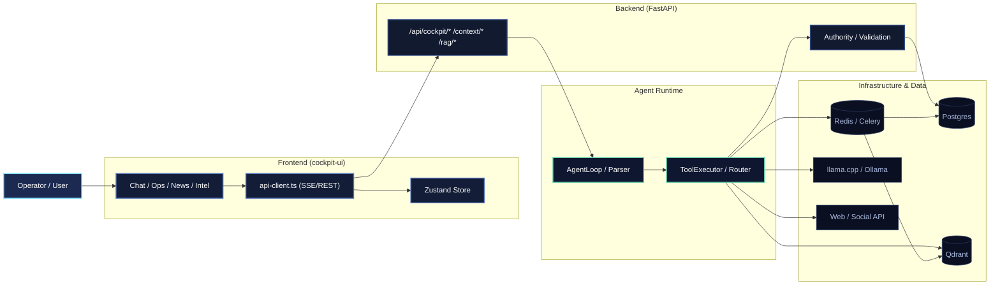
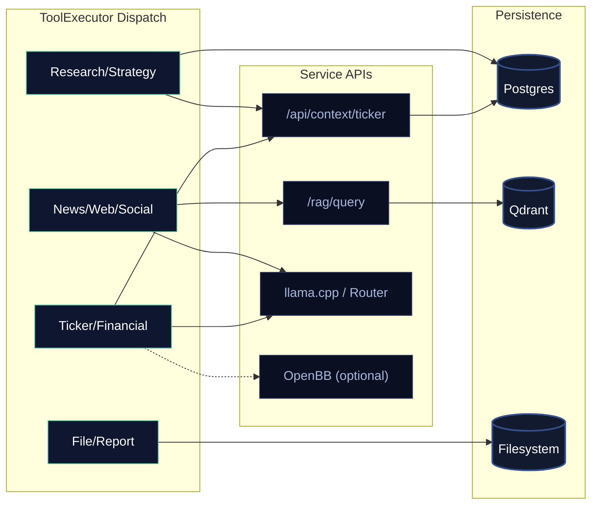
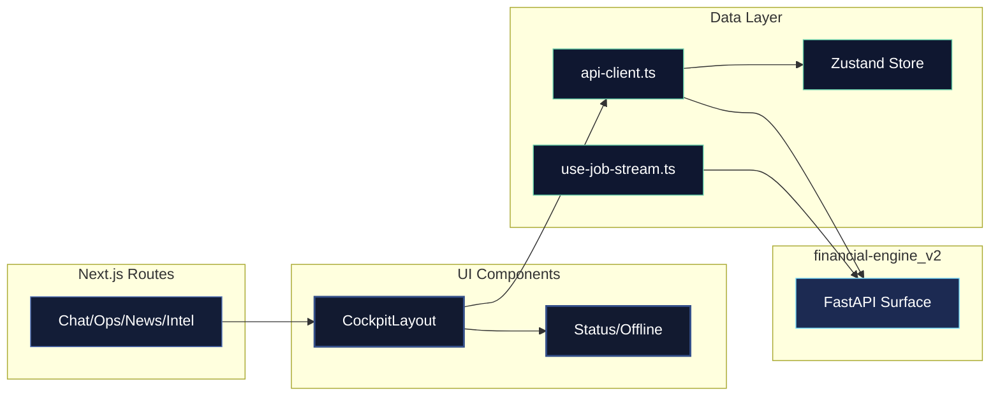

# Tenn Full System Map (Backend + Frontend)

**Interactive Dashboard:** `docs/tenn-system-map.html` (Recommended for viewing)
**Bundled PDF:** `docs/architecture/tenn_diagrams_booklet.pdf` (Static export)

This map documents Tenn as it exists in `financial-engine_v2` and `cockpit-ui`.

## 1) End-to-End System Topology



## 2) LLM Tool-Call Lifecycle

```mermaid
sequenceDiagram
  autonumber
  participant User
  participant UI as cockpit-ui
  participant API as FastAPI
  participant Loop as AgentLoop
  participant Exec as ToolExecutor
  participant Data as Data/Inference

  User->>UI: Request Action
  UI->>API: POST /chat (SSE)
  API->>Loop: Run Cycle
  Loop->>Loop: Parse Response

  alt is Read-Only
    Loop->>Exec: execute(read_only_tool)
    Exec->>Data: Fetch Context
    Data-->>Exec: Raw Results
    Exec-->>Loop: Structured Data
    Loop-->>API: Stream Answer
    API-->>UI: Display Response
  else is Mutating
    Loop->>Exec: propose(mutating_tool)
    Exec-->>Loop: action_proposal (Preview)
    Loop-->>API: Stream Proposal
    API-->>UI: Show Confirmation UI
    User->>UI: Confirm
    UI->>API: POST /action/execute
    API->>Data: Run Celery Job
    Data-->>UI: Job Status (Polling)
  end
```


## 3) LLM-Accessible Tool Surface (Current)

### Read-only tools
- `query_ticker_data`
- `get_company_dump`
- `get_price`
- `get_price_on_date`
- `get_price_range`
- `get_financials`
- `search_news`
- `search_announcements`
- `search_files`
- `list_recent_reports`
- `get_data_quality`
- `run_analysis`
- `fetch_url`
- `get_strategy`
- `search_web`
- `search_social`
- `recall_dossier`
- `deep_research`
- `get_watchlist_alerts`
- `scan_watchlist`
- `score_ticker`
- `screen_tickers`
- `get_valuation`
- `get_thesis`
- `check_decision_outcome`
- `review_open_decisions`

### Mutating tools (confirmation-gated)
- `run_backfill`
- `run_metric_extraction`
- `run_news_ingest`
- `run_announcement_ingest`
- `update_financials`
- `rebuild_financials`
- `audit_financials`
- `save_research_finding`
- `generate_chart`
- `create_thesis`
- `add_thesis_evidence`
- `reflect_on_decision`
- `adjust_signal_weights`

## 4) Information Sources by Subsystem



## 5) Frontend Subsystem Map




## 6) Delegation-Oriented Subsystem Inventory

- **Frontend UX shell**: layout, sidebar, status/offline, route navigation.
- **Frontend feature modules**: chat, operations, verification, intel pulse, news, history/settings/updater.
- **Frontend client integration**: REST + SSE wrappers, persistent stores, job stream hooks.
- **Backend API layer**: cockpit routes, context routes, extraction-review routes, process routes, RAG/commentary routes.
- **Agent runtime**: `AgentLoop`, `ResponseParser`, `ToolExecutor`, `ToolRouter`, `ActionRegistry`, tool schemas.
- **Execution layer**: action previews, confirmation gates, async job launch/tracking, Celery tasks.
- **Data layer**: Postgres (structured truth), Qdrant (vector/commentary retrieval), Redis (queue broker), file artifacts.
- **Inference/model layer**: llama.cpp primary runtime, optional Ollama compatibility path, model routing policy.
- **External intel/data sources**: ASX/news ingestion providers, web/social search clients, optional OpenBB market data sidecar.
