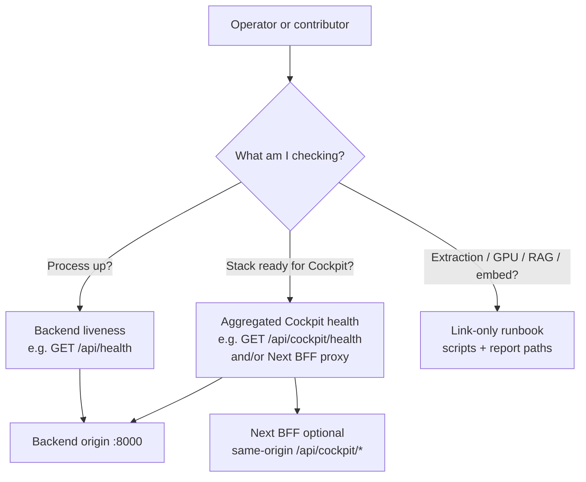

# Cockpit contract and operator observability

## Problem Frame

**Who:** Operators and contributors debugging Cockpit (Textual TUI, Next.js web UI) against the financial-engine backend.

**What:** `docs/claude/STATE.md` still flags a **Cockpit contract vs code mismatch** under docs-governance. In practice, people confuse **minimal backend liveness** with **aggregated Cockpit health**, and there is no single place that ties **extraction activity**, **GPU guard**, **RAG stability outputs**, and **embedding baseline signals** to the same mental model as the **SYSTEM_CONTRACT** Cockpit role (client + orchestration only; authoritative reads via backend when configured).

**Why it matters:** Wrong-surface debugging (e.g. treating a TUI issue as a web-only path) and redundant doc drift increase time-to-fix and risk of advice that violates the contract (e.g. implying Cockpit should read authoritative data outside `BackendApiClient`).

## Requirements

**Authoritative contract (documentation)**

- R1. Add a **Cockpit contract** document under `docs/architecture/` that states Cockpit’s role in terms aligned with `docs/architecture/SYSTEM_CONTRACT.md` (client + orchestration; no authoritative Qdrant/Postgres reads when `BackendApiClient` is configured; retrieval only via backend APIs).
- R2. **`docs/architecture/SYSTEM_CONTRACT.md`** gains a **short pointer** (subsection or table row) to that Cockpit contract doc so the system spine remains single-entry without copying the whole contract twice.
- R3. The Cockpit contract doc **names the behavioral split** between **minimal liveness** (`GET /api/health` — matches canonical boot checks in `docs/entrypoints.md`) and **aggregated Cockpit health** (`GET /api/cockpit/health` on the backend), including **when an operator should use which** (liveness first; aggregated for dependency / Cockpit-specific status). *Verified:* Python Cockpit `BackendApiClient.health()` calls `GET /api/health` in `financial-engine_v2/cockpit/integrations/backend_api.py`.
- R4. The contract doc **lists supported consumer patterns** at a product level: e.g. operators and scripts may call the **backend** directly; **browser** UIs use the **Next.js** BFF under `cockpit-ui/app/api/cockpit/` where present — without prescribing implementation refactors in this requirements set.
- R5. **No secrets in markdown:** only header **names** (e.g. `X-API-Key`) and references to env var **names**, never example keys or `.env` contents.

**Conformance audit**

- R6. Produce a **conformance matrix** (markdown table): each **normative contract line** (or small group of lines) → **where it is implemented** (e.g. `financial-engine_v2/cockpit/integrations/backend_api.py`, `financial-engine_v2/backend/app/routes/cockpit_api.py`, relevant `cockpit-ui` routes, representative tests).
- R7. Every matrix row has an explicit outcome: **conform**, **intentional deviation** (with one-line rationale), or **deprecate** (with consumer impact called out).

**Operator runbook**

- R8. Add a **link-only** runbook under `docs/ops/` whose primary content is a table: **question** (e.g. API up? extraction active? GPU OK? last RAG stability? embed model / dim?) → **command or doc path** → **where to read the answer** (no long prose duplication of existing architecture docs).
- R9. The runbook includes a **profile note** for local backend (`LOCAL_BACKEND_PROFILE=isolated` vs full / docker) so a smoke run is not misread as a full RAG/embed failure.
- R10. **Success check:** a new operator can complete every row of that table using **only** the runbook and linked targets (dry-run acceptance).

## Success Criteria

- The open **Cockpit contract / code mismatch** in `docs/claude/STATE.md` can be **closed or narrowed** with a pointer to the new contract doc and matrix (exact STATE wording is a planning/PR task).
- Operators can answer **liveness vs Cockpit health** without reading source.
- No duplicate “source of truth” for norms: **SYSTEM_CONTRACT** remains authoritative; Cockpit doc is an **addendum** plus audit artifact.

## Scope Boundaries

- **In scope:** Milestones A–C from `docs/superpowers/plans/2026-04-11-ideation-combinations.md` (Program Beta).
- **Out of scope:** Optional **single-pane** dashboard or CLI aggregator (plan Milestone D); changes to extraction quality, real-gold gates, or FX (Program Alpha); merging or deduplicating `.claude` / `.codex` / `.cursor` skill trees.
- **Out of scope:** New backend features solely to “prettify” health unless the conformance matrix exposes a **blocking** gap (then that row becomes a separate product decision).

## Key Decisions

- **Doc split:** Cockpit **norms and surfaces** live in `docs/architecture/`; the **operator runbook** lives in `docs/ops/` and links outward. Rationale: keeps architecture authority next to `SYSTEM_CONTRACT.md`, ops ergonomics in the ops tree.
- **Health precedence:** **`/api/health`** is the default **minimal** check; **`/api/cockpit/health`** is for **Cockpit-relevant aggregated** status. Rationale: matches `docs/entrypoints.md` and current `BackendApiClient` behavior.

## Dependencies / Assumptions

- Assumes existing routes and scripts referenced in `docs/superpowers/plans/2026-04-11-ideation-combinations.md` remain the integration points; if the matrix finds drift, **documentation or a follow-up fix** is filed — not silent ignore.
- Depends on **peer review** against `docs/architecture/SYSTEM_CONTRACT.md` before calling the contract doc “done.”

## Outstanding Questions

### Resolve Before Planning

- (none — doc home and health precedence decided above)

### Deferred to Planning

- **[Technical]** Exact filename for the architecture addendum and whether to fold part of the matrix into the same file vs `docs/ops/` only.
- **[Technical]** Whether `GET /api/cockpit/config` alone is sufficient for extraction-mutex visibility long-term or whether health should later embed a summary (product follow-up, not required for this requirements set).
- **[Needs research]** Whether any **external** consumers today call Next BFF vs backend directly — matrix should be validated against actual usage (grep/docs).

## Next Steps

→ `/ce:plan` using this requirements doc as input, aligned with Program Beta in `docs/superpowers/plans/2026-04-11-ideation-combinations.md`.

## Alternatives Considered

- **Ops-only contract doc:** Rejected as primary home — weakens discoverability next to `SYSTEM_CONTRACT.md`.
- **Single combined mega-doc:** Rejected — runbook should stay link-light and ops-scoped to limit rot.
