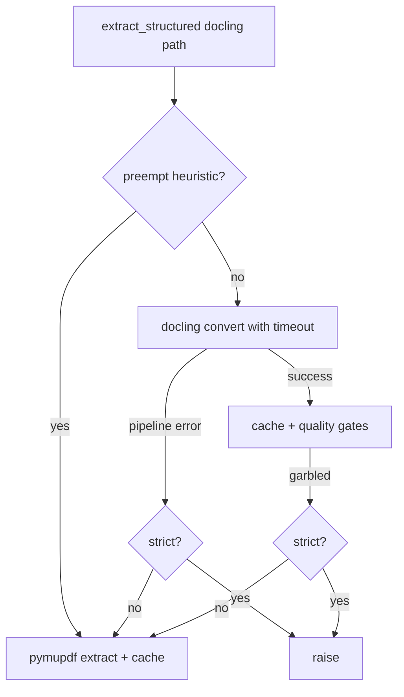

# fix: Docling large-PDF crash resilience

## Overview

Reduce **hard `parser_error` / full null extraction** outcomes when IBM docling’s **StandardPdfPipeline** fails on large or pathological PDFs, while keeping **observable provenance** (method tags, logs, structured fields) so this does not become a silent fallback. Evidence: **§4, §9, §12.2, §14.2** in the origin benchmark — `bhp_a_2025-06-30` (~15 MB, 200+ pages) crashes docling; pymupdf already handles that file when used as parser.

## Problem Frame

Today, `extract_structured` in `financial-engine_v2/backend/app/services/docling_extract.py`:

- **Preempts** docling for a **narrow** profile: `page_count >= 200` **and** `file_size >= 12 MiB`, **only when** `strict_backend=False`.
- On other docling failures (`RuntimeError` / pipeline exceptions), **does not** retry with PyMuPDF — multipass returns **`parser_error`** and empty metrics.
- **`page_count == 0`** (open/count failure) bypasses preempt (`0 < 200`) and can still invoke docling with **minimum** timeout.

The benchmark and production both need **predictable recovery** without violating **SYSTEM_CONTRACT** rules against **silent** masking: any recovery must be **logged** and reflected in **`extraction_method` / `_structured_extraction` / `fallback_used`** semantics already used for large-PDF preempt and garbled-table handling.

## Requirements Trace

- **R1.** When `strict_backend=False` and docling fails with a **hard pipeline error** (including `StandardPdfPipeline` class failures), the system should **attempt** structured extraction via **PyMuPDF** before surfacing a terminal parser failure — unless a documented policy explicitly excludes that failure class.
- **R2.** When `strict_backend=True`, behavior stays **fail-fast** on docling (no automatic PyMuPDF) to preserve A/B and audit paths that require a specific parser.
- **R3.** Expand or clarify **large-PDF preemption** so the known benchmark failure mode and **near-miss** profiles (e.g. high byte size with **&lt;200** pages, or **≥200** pages with **&lt;12 MiB** that still crash) are **addressed by policy**, not accident.
- **R4.** **`page_count` unavailable** must have an explicit, tested behavior (early error vs pymupdf vs skip docling).
- **R5.** **Provenance:** Logs + structured payload must show **actual backend used** and whether a **docling→pymupdf** recovery ran (aligned with existing `fallback_used` rules in multipass).
- **R6.** **Regression tests** cover preempt boundaries, retry path, strict non-retry, and parser error classification.
- **R7.** **Documentation** updates tie behavior to the benchmark and architecture PDF stack docs.

## Scope Boundaries

- **In scope:** `docling_extract.extract_structured`, multipass/parser error classification touchpoints if needed for consistency, unit tests, architecture/ops notes.
- **Out of scope:** Changing **default production parser** policy (benchmark already says keep docling default), **normalization registry**, **LLM net_debt prompts** (separate workstream), **docling version upgrade** as the sole fix (may be a follow-up spike, not required for this plan).
- **Out of scope:** Cockpit-only changes; backend remains authoritative.

## Context & Research

### Relevant Code and Patterns

- **Parser core:** `financial-engine_v2/backend/app/services/docling_extract.py` — `extract_structured`, `_should_preempt_docling_for_large_pdf`, `_run_docling_with_timeout`, `_extract_pymupdf`, cache suffixes `.docling.json` / `.pymupdf.json`.
- **Multipass:** `financial-engine_v2/backend/app/services/multipass_extraction.py` — calls `extract_structured`, sets `fallback_used` when `extraction_method.startswith("pymupdf")` and requested backend is docling-like; maps exceptions to `parser_error` when `"docling" in str(e).lower()` or `ExtractionTimeoutError`.
- **Pipeline taxonomy:** `financial-engine_v2/backend/app/services/pipeline.py` — `classify_extraction_failure` substring heuristics; align any new error messages or paths with existing review buckets where practical.
- **Eval reproduction:** `scripts/run_real_extraction_eval.py` — `run_multipass_extraction(..., parser_backend=..., strict_parser` default **False**).
- **Tests (verify drift):** `financial-engine_v2/backend/tests/test_docling_extract.py`, `test_multipass_extraction.py` — research noted possible **timeout vs fallback** expectation drift; implementer must **reconcile tests with intended policy** as part of this work.
- **Docs:** `docs/architecture/05_pdf_extraction_and_chunking.md`, `docs/claude/audits/pdf_extraction_pipeline_audit.md`, `docs/ops/docling_gpu_tesla_m40.md`.

### Institutional Learnings

- **`docs/solutions/`** is **not present** in this repo; closest institutional notes are under `docs/ops/` and `docs/claude/audits/` (timeouts, GPU stack, fallback narrative).

### External References

- None required for planning; **docling** is already constrained in `financial-engine_v2/backend/requirements.txt` (`docling>=2.75.0,<3.0.0`). Optional **spike** (deferred): release notes for pipeline stability on large PDFs.

## Key Technical Decisions

- **D1 — Where to retry:** Implement **docling→pymupdf recovery inside `extract_structured`** (not only in multipass) so all callers share one behavior and return a normal `StructuredDocument` with correct **`extraction_method`** / degradation tags. *Rationale:* single choke point, matches existing preempt and garbled paths.

- **D2 — Timeout behavior:** Treat **`ExtractionTimeoutError`** as **policy-sensitive**: default **no** pymupdf retry (long-running doc may be pathological; operator may prefer failure). Optionally gate retry with **`DOCLING_FALLBACK_AFTER_TIMEOUT=1`** (or similar) if product wants parity with pipeline crash recovery. *Rationale:* avoids multi-minute double work unless explicitly enabled. **Resolve in implementation** after reviewing current `parser_timeout` handling in pipeline.

- **D3 — Preempt heuristic:** Move from “**AND only**” to a **documented matrix** — e.g. add **size-only** branch (`file_size >= X` regardless of page count) and/or **lower page floor** for known crash class — with **conservative defaults** to avoid broad unintended pymupdf use. Exact thresholds **deferred to implementation** with a short comment citing benchmark file profile.

- **D4 — Strict mode:** **No** automatic pymupdf on docling failure when `strict_backend=True` (eval/method isolation). *Rationale:* preserves purity of `parser_backend=docling` strict runs.

- **D5 — SYSTEM_CONTRACT §8 / §10.3:** Framed as **observable** parser degradation (already established for large-PDF preempt), not silent backend failure masking. Implementer should **note pre-flight** in PR: target layer = parser; invariant = financial truth not written on parser_error paths anyway.

## Open Questions

### Resolved During Planning

- **Q:** Should eval `run_real_extraction_eval` force preempt for benchmark parity? **A:** Default `strict_parser=False` already allows preempt; remaining gap is **non-preempt failures** — addressed by **D1** / **D3**.

### Deferred to Implementation

- **Exact preempt thresholds** after measuring BHP-like files in `data/asx/docs/` (page count + size distribution).
- **Whether timeout retry** is desirable in production vs eval-only flag — confirm with `pipeline.py` timeout classification and ops preference.
- **Garbled-table branch** after successful docling: code raises after saving `.docling.json` with a “strict” message even when `strict_backend` may be false — **verify current tests** and fix comment/branch if behavior is unintentional (optional defect sweep in Unit 1).

## High-Level Technical Design

> *This illustrates the intended approach and is directional guidance for review, not implementation specification. The implementing agent should treat it as context, not code to reproduce.*

**Decision matrix (non-strict `strict_backend=False`):**

| Condition | Desired behavior |
|-----------|------------------|
| Preempt heuristic matches | Skip docling → `_extract_pymupdf`, cache `.pymupdf.json`, log warning (existing). |
| Docling raises (e.g. StandardPdfPipeline) | Catch → `_extract_pymupdf`, set method tag indicating **docling failed, pymupdf used** (reuse or extend `pymupdf_degraded` / new tag per existing conventions), log error + recovery. |
| Docling timeout | Default: **re-raise** `ExtractionTimeoutError`; optional env enables pymupdf retry. |
| `page_count == 0` | Do **not** call docling blindly; either return structured error or attempt pymupdf-only path — **pick one** and test. |

**Strict mode:** Same table but **no** pymupdf columns except where already allowed (e.g. garbled cache path for strict is already “raise”).

## Implementation Units

- [ ] **Unit 1: Policy spec + threshold design note**

**Goal:** Lock the matrix (D1–D4) into maintainable prose and inline comments so future edits do not reintroduce silent paths.

**Requirements:** R3, R7

**Dependencies:** None

**Files:**
- Modify: `docs/architecture/05_pdf_extraction_and_chunking.md`
- Modify: `financial-engine_v2/backend/app/services/docling_extract.py` (module-level / function docstrings for preempt + retry policy)
- Test: *Test expectation: none — documentation and comments only.*

**Approach:** Document preempt inputs (page, size, strict), recovery path on docling exception, timeout policy, and pointer to origin benchmark. Add a short “Contract note” that recovery is **logged** and visible via `extraction_method` / multipass provenance.

**Test scenarios:**

- *Test expectation: none — documentation-only unit.*

**Verification:** Another developer can predict behavior for BHP 2025–like files without reading the whole module.

---

- [ ] **Unit 2: Expand `_should_preempt_docling_for_large_pdf` (and helpers)**

**Goal:** Close gaps where large or heavy PDFs skip preempt (e.g. **size-only**, **page_count** edge cases).

**Requirements:** R3, R4

**Dependencies:** Unit 1

**Files:**
- Modify: `financial-engine_v2/backend/app/services/docling_extract.py`
- Test: `financial-engine_v2/backend/tests/test_docling_extract.py`

**Approach:** Introduce configurable thresholds (constants and/or env vars with safe defaults). Handle **`page_count == 0`** explicitly before docling invocation. Keep **strict_backend** bypass unchanged.

**Test scenarios:**

- **Happy path:** PDF with pages≥threshold and size≥threshold → pymupdf invoked, no docling call (mock docling if needed).
- **Edge case:** High size, pages below old floor → preempt triggers if size-only rule applies.
- **Edge case:** `page_count` 0 from broken path → documented behavior (error or pymupdf) asserted.
- **Error path:** `strict_backend=True` + large PDF → docling still attempted (or fails per strict garbled rules), **no** pymupdf preempt.

**Verification:** Unit tests green; behavior matches doc matrix from Unit 1.

---

- [ ] **Unit 3: Docling failure recovery → PyMuPDF (non-strict)**

**Goal:** On docling **exception** (non-timeout by default, per D2), attempt `_extract_pymupdf` when `strict_backend=False`.

**Requirements:** R1, R2, R5

**Dependencies:** Unit 2 (may share threshold helpers; can parallelize if interfaces stable)

**Files:**
- Modify: `financial-engine_v2/backend/app/services/docling_extract.py`
- Modify (if needed): `financial-engine_v2/backend/app/services/multipass_extraction.py` — only if `fallback_used` / observer messages need adjustment for new method tag
- Test: `financial-engine_v2/backend/tests/test_docling_extract.py`, `financial-engine_v2/backend/tests/test_multipass_extraction.py`

**Approach:** Wrap `_run_docling_with_timeout` failure path; **do not** write a successful `.docling.json` cache for failed runs; ensure pymupdf result is cached under `.pymupdf.json` where appropriate. Log **structured context** (path, exception type, page_count, size). Align **`extraction_method`** string with existing multipass `fallback_used` detection.

**Execution note:** Reconcile any **existing tests** that expect raise on timeout vs pymupdf fallback — update tests to match **D2** policy.

**Test scenarios:**

- **Happy path:** Simulated docling `RuntimeError` containing `StandardPdfPipeline` → pymupdf succeeds → returned `StructuredDocument` has pymupdf method tag.
- **Edge case:** Same with `strict_backend=True` → **no** pymupdf recovery, exception propagates.
- **Error path:** pymupdf also fails → propagate **clear** error; no partial silent success.
- **Integration:** `run_multipass_extraction` ends with **success** path (not `parser_error`) when recovery succeeds — metrics pipeline runs.

**Verification:** Target document class from benchmark no longer yields bare `parser_error` for default non-strict ingestion when pymupdf can parse the file.

---

- [ ] **Unit 4: Pipeline / failure taxonomy alignment (light touch)**

**Goal:** Same failure mode should classify consistently for **manual review** and **telemetry**.

**Requirements:** R5

**Dependencies:** Unit 3

**Files:**
- Modify: `financial-engine_v2/backend/app/services/pipeline.py` (only if new error strings or statuses appear)
- Test: `financial-engine_v2/backend/tests/test_pipeline_stages.py` or targeted pipeline test file (grep for `classify_extraction_failure`)

**Approach:** If recovery succeeds, pipeline should see **normal extraction success** with provenance flag; if recovery fails, ensure substring classification still maps to **`parser_error`** / review. Avoid duplicate contradictory buckets.

**Test scenarios:**

- **Integration:** Simulated end-to-end flag from multipass into pipeline stage classification for **recovered** vs **unrecoverable** parser failure.

**Verification:** No regression in existing pipeline failure tests.

---

- [ ] **Unit 5: Benchmark + architecture cross-links**

**Goal:** Close the loop on the origin report so operators know behavior changed.

**Requirements:** R7

**Dependencies:** Units 3–4 complete

**Files:**
- Modify: `reports/benchmark_2026-04-10/BENCHMARK_REPORT.md` — short **addendum** paragraph under §12 or §14 stating *post-fix* expectation (docling crash mitigated by recovery) and **date**, **without** rewriting full benchmark numbers until a re-run is executed.
- Modify: `docs/architecture/12_evaluation_and_drift_monitoring.md` — one sentence if eval harness behavior changes (e.g. fewer `parser_error` for large PDFs).

**Approach:** Document **intent** first; optional second commit can paste **new eval numbers** after `scripts/run_real_extraction_eval.py` re-run on the same corpus.

**Test scenarios:**

- *Test expectation: none — markdown-only.*

**Verification:** Benchmark readers see explicit “implementation follow-up” note.

---

## System-Wide Impact

- **Interaction graph:** `process_document` → `run_method_isolated_extraction` → `run_multipass_extraction` → `extract_structured`; verification UI and eval scripts that call multipass directly.
- **Error propagation:** Successful recovery **reduces** `parser_error` volume; failed recovery must still surface **actionable** errors.
- **State lifecycle risks:** Cache coherence between `.docling.json` and `.pymupdf.json` after failed docling — avoid treating stale docling cache as success; document any cache invalidation added.
- **API surface parity:** No REST contract change expected; **provenance JSON** inside payloads may gain clearer method strings.
- **Unchanged invariants:** **SYSTEM_CONTRACT** database and RAG authority; **strict** parser runs for method isolation remain **unchanged** in intent.

## Risks & Dependencies

| Risk | Mitigation |
|------|------------|
| Over-broad pymupdf use degrades average extraction quality | Conservative thresholds; log volume metrics; feature flag or env for retry if needed |
| Double runtime on timeout if retry enabled | Default timeout **no** retry; document cost |
| Test / implementation drift (noted in research) | First milestone: run **full** `pytest` on `test_docling_extract` and `test_multipass_extraction` |
| SIGALRM / worker context | Follow existing `main.py` / Celery notes; add test in **process model** used in CI if applicable |

## Documentation / Operational Notes

- Update **`docs/architecture/05_pdf_extraction_and_chunking.md`** large-PDF / fallback section to match post-change behavior.
- Optional: **`financial-engine_v2/README.md`** or **`financial-engine_v2/CLAUDE.md`** env var table if new knobs are added.

## Sources & References

- **Origin document:** [reports/benchmark_2026-04-10/BENCHMARK_REPORT.md](../../reports/benchmark_2026-04-10/BENCHMARK_REPORT.md)
- **Contract:** [docs/architecture/SYSTEM_CONTRACT.md](../architecture/SYSTEM_CONTRACT.md)
- **Primary implementation:** `financial-engine_v2/backend/app/services/docling_extract.py`
- **Research:** repo-research-analyst + spec-flow-analyzer handoffs (session 2026-04-11)
